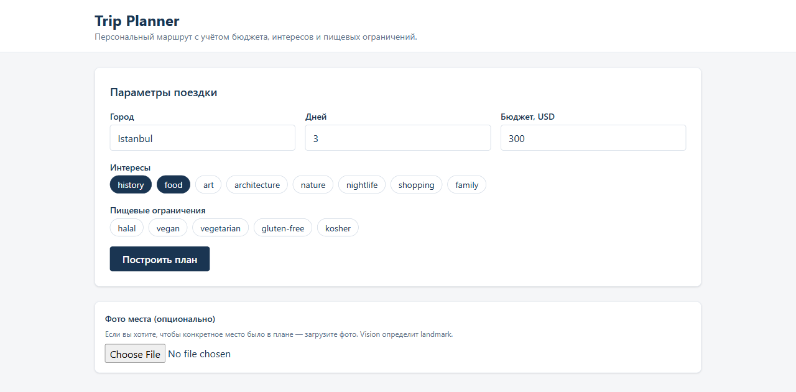
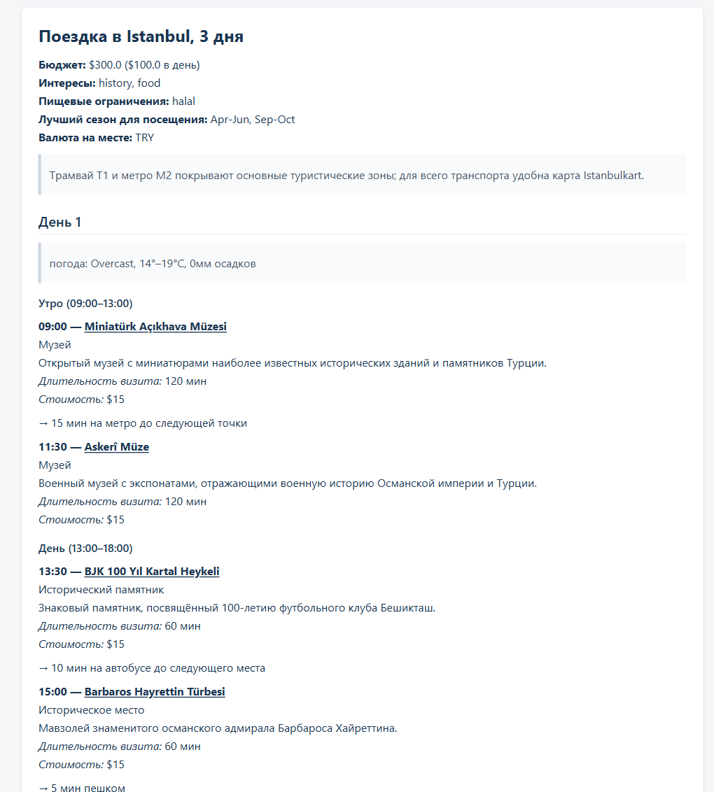

# Trip Planner

**LLM-агент персонального планирования путешествий**

Курс nFactorial — LLM Stack

---

## Проблема

Туристическое планирование «руками» — это:

- **Часы скроллинга** TripAdvisor / Reddit / блогов в попытке собрать день по часам
- **Бюджет** не отслеживается — реалистичная стоимость становится понятной постфактум
- **Dietary restrictions** (halal, vegan, gluten-free) проверяются вручную по каждому ресторану
- **Погода и логистика** не сшиваются с маршрутом
- **Правки**: «убери музеи, добавь халяль» — никакой инструмент не делает это точечно

---

## Решение

Веб-приложение, которое за **~1–4 минуты** собирает персонализированный day-by-day план:

1. Пользователь задаёт **город, дни, бюджет, интересы, dietary**; опционально — фото места.
2. LLM-агент через **LangGraph + 3 MCP-сервера + RAG** собирает план: реальные POI из OSM, рестораны с halal-маркерами, погода, оптимизированный маршрут.
3. Пользователь пишет правки в свободной форме — точечный патч, не перегенерация.
4. **Accept → PDF**.

---

## User flow — 5 шагов

1. **Форма** — город, дни, бюджет, интересы, dietary; опционально фото места.
2. **Прогресс (SSE)** — live-статус по нодам графа в реальном времени.
3. **Готовый план** — реальные POI, halal-маркеры, погода, бюджет, источники.
4. **Правка** — текстом в свободной форме; точечный патч, не перегенерация.
5. **Accept → PDF** — финализация и экспорт.

Stack фронта: Vite + React 19 + Tailwind + shadcn/ui, валидация zod.

---

## Шаг 1 — Форма ввода



Город, дни, бюджет, интересы и dietary — chips с мультивыбором. Опционально — фото места (Vision определит landmark). Валидация на клиенте через zod.

---

## Шаг 2 — Прогресс по нодам (SSE)


Бэкенд стримит статус каждой ноды графа через Server-Sent Events — пользователь видит, что агент делает прямо сейчас. Параллельно фронт поллит `/state` каждые 3с как resilient fallback.

---

## Шаг 3 — Готовый план



Погода (Open-Meteo), переходы между точками, OSM-ссылки на каждое место, длительность и стоимость. Ниже по плану — halal-маркеры, таблица сводного бюджета и источники (Wikivoyage + OSM).

---

## Шаг 4-5 — Правка и экспорт

**Правка в свободной форме** («убери музеи», «добавь халяль»):

`parse_edit_intent` (structured output) → `patch_plan` — точечный патч, а не перегенерация; rich-markdown (погода, маркеры, бюджет) сохраняется.

**Accept** → `finalize_and_export` → PDF через weasyprint.

---

## Архитектура — high-level

```
Frontend (React) ──HTTP+SSE──► FastAPI ──► LangGraph (14 нод)
                                              │
                  ┌───────────────────────────┼────────────────────────┐
                  ▼                           ▼                        ▼
            travel-tools              city-knowledge              trip-utilities
            (Overpass / Open-Meteo /  (Qdrant wrapper —          (currency / cost /
             OSRM, 4 tools)            text-embedding-3-small,    dietary, 3 tools)
                                       3 tools)
```

Один docker-compose: qdrant + backend + frontend. MCP-серверы — stdio-subprocess'ы backend'а (не отдельные compose-сервисы). LangSmith трассирует всё автоматически.

---

## LangGraph — 14 нод, 3 ветвления, 2 цикла, 2 HITL

```
collect_input ──{has_photo?}──► vision_identify → enrich_input
       │                                                    │
       ▼                                                    ▼
city_research → candidate_places → budget_check ──{feasible?}─► cluster_by_day
                                          │ NO                       │
                                          ▼                          ▼
                                explain_and_ask                optimize_route
                                  (HITL ◄─loop)                      │
                                                                     ▼
                              parse_edit_intent ◄────────── generate_plan
                                       │                             │
                                       ▼                             ▼
                                  patch_plan ──► present_plan (HITL)
                                                       │
                                                       ▼ accept
                                              finalize_and_export → END
```

`AsyncSqliteSaver` checkpointing. `EVAL_MODE=true` обходит HITL для автопрогона evals.

---

## MCP server #1 — travel-tools

**Назначение:** доступ к внешнему миру через бесплатные публичные API. Никакой LLM-логики.

| Tool | Источник | Возвращает |
|---|---|---|
| `find_places` | Overpass (OSM) | список `Place` по категориям (museum / park / historical / religious / nightlife / shopping) |
| `find_restaurants` | Overpass `diet:*` теги | `Restaurant` с `dietary_confidence` |
| `get_weather_forecast` | Open-Meteo | дневной прогноз, до 16 дней |
| `compute_route` | OSRM | `RouteResult` (длина/время) для walk/transit/drive |

**Resilience:** `_overpass_query` крутит 5 попыток через 3 зеркала Overpass с экспоненциальным backoff — main endpoint регулярно отдаёт 504.

---

## MCP server #2 — city-knowledge (RAG wrapper)

**Назначение:** агент через MCP обращается к собственному RAG-индексу — не только внешние API.

| Tool | Возвращает |
|---|---|
| `search_city_guide(city, query, k, section?)` | top-k `GuideChunk` из Wikivoyage |
| `get_city_overview(city)` | `CityOverview` — валюта, языки, безопасность, транспорт, лучший сезон |
| `list_indexed_cities()` | какие города проиндексированы (graceful fallback) |

**Stack:** `text-embedding-3-small` (1536-dim) → Qdrant `query_points(query=vector, query_filter=Filter(city=..., kind=...))`. Одна коллекция на все города, фильтр по metadata-полю `city`.

---

## MCP server #3 — trip-utilities

**Назначение:** доменные утилиты — без сети, чистая логика.

| Tool | Что делает |
|---|---|
| `convert_currency` | конвертация через frankfurter.app |
| `estimate_plan_cost` | агрегирует стоимость по дням → `CostBreakdown` |
| `validate_dietary_match` | эвристика по cuisine + OSM `diet:*` тегам → `accommodates` / `partial` / `does_not_accommodate` |

---

## Skill — `itinerary-formatter`

`skill/itinerary-formatter/SKILL.md` — единый формат для UI и PDF.

Вызывается в двух нодах: `generate_plan` и `finalize_and_export`.

**Hard rules:**
1. Никогда не упоминать место, которого нет в `state.candidate_places` / `candidate_restaurants` / `city_context`.
2. Каждое место — ссылка на OSM или Wikivoyage.
3. Цены/часы — только из tool-output, нет — пиши «не указано».
4. Dietary: ресторан без `dietary_confidence >= 0.5` не попадает в план.
5. Превышение бюджета — явный маркер-предупреждение в конце дня.

Skill — это **контракт между LLM и UI**: гарантирует консистентность markdown во всех путях рендеринга.

---

## RAG — Wikivoyage → Qdrant

```
Wikivoyage страница города
    │
    ▼
chunking по секциям (See / Do / Eat / Drink / Sleep / Get around)
    │
    ▼
OpenAI text-embedding-3-small (1536-dim)
    │
    ▼
Qdrant collection trip_planner_v1
  metadata: { city, section, kind, source_url, ingested_at }
    │
    ▼
city-knowledge.search_city_guide(city, query, section?)
```

**5 indexed cities:** Istanbul, Barcelona, Lisbon, Tokyo, Mexico City. Одна коллекция, фильтр по `city` — НЕ collection-per-city.

---

## Мультимодальность — vision_identify

Опциональная нода, активируется когда пользователь загружает фото места:

1. Frontend: `PhotoUpload.tsx` → POST `/sessions/{id}/photo` (multipart, ≤ 5MB).
2. Бекенд: base64 → `gpt-4.1-mini` (vision-режим, тот же mini что и для plan-генерации).
3. Output: `PhotoAnalysis { landmark, city, place_type, description, confidence }`.
4. `enrich_input`: `place_type` фото добавляется в интересы; если `confidence >= 0.7` и город не задан — город берётся из фото. `photo_analysis` уходит в контекст `generate_plan`.

Демо: фото Голубой Мечети → `{landmark: "Blue Mosque", city: "Istanbul", confidence: 0.95}`.

---

## Evals — dataset + метрики

**Golden dataset:** `trip-planner-golden-v1` в LangSmith, **10 примеров**.

Покрытие: 5 indexed cities, 1 non-indexed (Paris, для graceful fallback), 2 photo-кейса, 4 dietary (halal, vegan, vegetarian, gluten-free), 3 edge (low budget, contradictory interests, no-index city).

**2 LLM-as-judge метрики** (gpt-4.1-mini, temperature 0.0):

| Метрика | Что проверяет | Target |
|---|---|---|
| `constraint_adherence` | budget ≤ заявленного, dietary соблюдены, дней ровно столько | ≥ 0.80 |
| `faithfulness` | каждое место в плане заземлено в tool-output | ≥ 0.95 |

Автопрогон через `langsmith.evaluate` с sync-обёртками async-judges.

---

## A/B результаты

`gpt-4.1-mini` (primary) vs `gpt-4o-mini` (secondary). Только модель меняется; embedding, RAG, prompts, MCP-tools — идентичны.

| Metric | gpt-4.1-mini | gpt-4o-mini | Δ |
|---|---:|---:|---:|
| `constraint_adherence` | 0.800 | 0.800 | 0.000 |
| `faithfulness` | **0.965** | 0.507 | **−0.458** |

**Вывод:** `gpt-4o-mini` галлюцинирует ~половину названий мест. На constraint_adherence паритет, но faithfulness — drama. Hard-правило «места только из RAG/tool-output» делает её непригодной для primary.

Артефакты: `evals/results/mini-41.csv`, `mini-4o.csv`, `ab_mini_41_vs_4o.md`. LangSmith projects: `mini-41-8980574a`, `mini-4o-ebf8458a`.

---

## LLM choice rationale

**Выбор: OpenAI mini family. Primary — `gpt-4.1-mini`** (везде: vision, generate_plan, parse_edit_intent, judges, finalize).

| Критерий | gpt-4.1-mini |
|---|---|
| Стоимость | ~$0.40/M input, ~$1.60/M output |
| Tool-use / structured output | strict mode, with_structured_output — стабильно |
| Vision | встроено в ту же модель — одна нода `vision_identify` |
| LangChain интеграция | `langchain-openai` — самый зрелый wrapper |
| Длинный контекст | 1M токенов (запас для stuff-context fallback) |
| Faithfulness (evals) | 0.965 vs 0.507 у `gpt-4o-mini` |

**Не выбрали:** Anthropic Claude (ограничение задачи), Google Gemini (пользователь сменил на OpenAI), Qwen (менее зрелая интеграция, vision отдельной моделью).

---

## Hyperparameters + production patterns

**Гиперпараметры:**
- `temperature=0.7` для генерации плана (нужен креатив в описаниях; факты приходят из RAG)
- `temperature=0.1` для intent parsing (structured output)
- `temperature=0.0` для LLM-as-judge (воспроизводимость)
- `max_tokens=4096` для плана, `512` для intent и vision
- Ретраи через tenacity: 3 попытки, exponential backoff 1→10s (только на 429/5xx)

**Resilience patterns:**
- Overpass: 5 попыток × 3 зеркала с backoff
- SSE: polling-fallback на `/state` каждые 3с, `X-Accel-Buffering: no` для nginx
- LangGraph: `AsyncSqliteSaver` checkpointing — можно возобновить с любого interrupt
- Бюджет HITL: флаг `budget_acknowledged` разрывает loop `explain_and_ask ↔ budget_check`

---

## Спасибо

**Trip Planner** — github.com/aidarfortraining/travel-agent

Demo: `docker compose up` → http://localhost:5173

LangSmith dashboard: `mini-41-8980574a` / `mini-4o-ebf8458a`

Вопросы?
